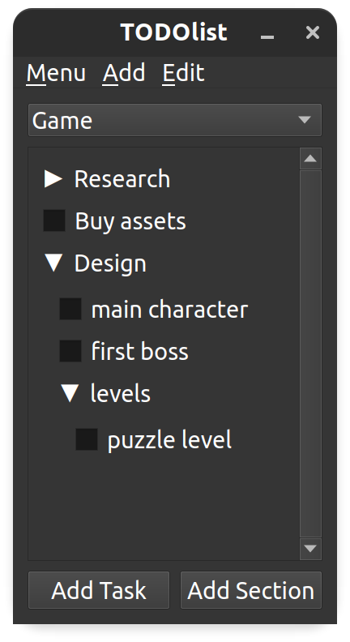

# TODOlist-v2
A revamped version of TODOlist that uses PyQt5

# Installation

* Clone the repository
* Run TODOlist.py

# Features

* Multiple TODOlists
* Tasks
* Sections
  * Holds tasks
  * Holds subsections (which can hold more tasks/ sections)
* Appending to the end of a list
* Inserting an element (task or element) before or after a right-clicked element
* Clear
  * Checked tasks in the current level
  * All checked tasks in the TODOlist
  * All elements in the list or section
